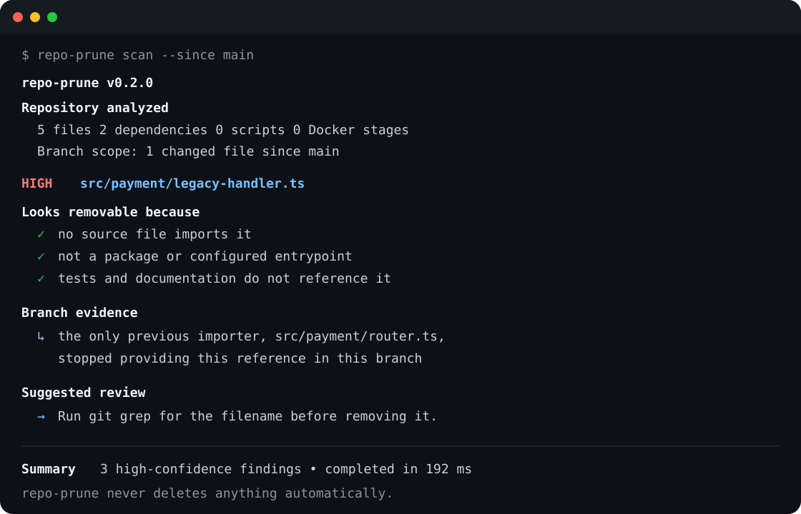

# repo-prune

**Stop guessing what's dead in your repo.**

Evidence-first repository cleanup for teams that delete carefully.

```bash
npx repo-prune scan --since main
```

repo-prune tells you what a feature-removal branch may have left behind—dead files, newly unused
dependencies, stale scripts, and orphaned environment variables—and shows both the evidence and the
caveats for every finding.



> repo-prune is deterministic, local, read-only, and never deletes anything automatically.

## The feature-removal check

You remove `src/payment/legacy-handler.ts`. The code review looks clean, but the branch also leaves
behind:

- `src/payment/legacy-types.ts`, whose only importer was removed;
- `moment`, which no remaining live file imports;
- `PAYMENT_LEGACY_TIMEOUT` in `.env.example`;
- `migrate-payment-v1` in `package.json`.

Grep can check each surface separately. repo-prune connects the branch change to what became
orphaned:

```text
HIGH   src/payment/legacy-types.ts
       Potential dead file

Looks removable because
  ✓ no source file imports it
  ✓ not a package or configured entrypoint
  ✓ tests and documentation do not reference it

Branch evidence
  ↳ the only previous importer, src/payment/legacy-handler.ts,
    was deleted in this branch

Possible caveat
  ! repository uses non-literal import() (src/plugins/loader.ts:14)

Suggested review
  → Review src/plugins/loader.ts:14, then run git grep for the filename.
```

Run this after deleting or rewriting a feature, before merging a cleanup PR, or when a migration may
have left repository artifacts behind.

## What makes it different

### Branch-aware evidence

```bash
repo-prune scan --since main
repo-prune scan --since origin/main
repo-prune scan --since abc123f
```

repo-prune inspects the merge-base diff and the previous content of changed or deleted files. It
filters out unrelated pre-existing findings and can explain that a file's previous importer, a
dependency import, or an environment-variable read disappeared in this branch.

### Cross-surface correlation

A shared reference index connects files, packages, scripts, and environment reads. If a dependency
is only imported by files that also look dead, the result says so explicitly instead of emitting two
unrelated warnings.

### Honest uncertainty

Findings contain three separate evidence groups:

- `supporting`: facts that make the artifact look unused;
- `contradicting`: repository evidence arguing against the conclusion;
- `uncertain`: runtime behavior the scanner found but cannot resolve statically.

Confidence is an explainable tier, not a fictional percentage. A detected `import(variable)`, glob
loader, framework decorator, plugin-shaped package, or external deployment boundary changes the
finding's caveats and can lower its confidence.

## Why not just use Knip?

[Knip](https://knip.dev/explanations/how-knip-works) is excellent. It has a mature JavaScript and
TypeScript graph, broad framework tooling, unused-export analysis, and optional fixes. Use Knip when
those are your main requirements.

repo-prune has a narrower cleanup-review goal:

| Capability                                                    | Knip |     repo-prune      |
| ------------------------------------------------------------- | :--: | :-----------------: |
| JS/TS unused files and dependencies                           |  ✅  |         ✅          |
| Unused exports and deep JS/TS framework coverage              |  ✅  |          —          |
| Python files and dependencies                                 |  —   |         ✅          |
| `.env` documented/used drift                                  |  —   |         ✅          |
| Docker stage reachability                                     |  —   |         ✅          |
| Branch-caused findings with `--since`                         |  —   |         ✅          |
| Per-finding supporting, contradicting, and uncertain evidence |  —   |         ✅          |
| Automatic fixes                                               |  ✅  | intentionally never |

If Knip already answers your questions, keep using it. If the question is “what did this cleanup PR
orphan across code, dependencies, scripts, and config—and what could make each conclusion wrong?”,
try repo-prune. Knip's current documented issue types are available in its
[official reference](https://knip.dev/reference/issue-types).

## Quick start

Requires Node.js 20 or newer.

The npm name is ready for publication but `0.2.0` is not published yet. Until the first registry
release, install directly from GitHub:

```bash
npm install --save-dev github:XUanhoa04/repo-prune
npx repo-prune scan --since main
```

After publication, the canonical zero-install command is:

```bash
# Zero-install scan
npx repo-prune scan

# The memorable workflow: inspect what this branch may have orphaned
npx repo-prune scan --since main

# Add it to a repository
npm install --save-dev repo-prune
npx repo-prune scan --format json
```

After cloning repo-prune itself:

```bash
npm install
npm run build
npm run demo:since
```

`npm run demo:since` creates a temporary Git repository, removes a feature, and runs the real CLI
against the resulting branch. `npm run demo` runs every detector against the static demo repository.

## What it detects

Core cleanup surfaces:

- potential dead JavaScript, TypeScript, and Python files;
- unused Node and Python dependencies;
- dependencies used only by potentially dead files;
- stale npm scripts;
- environment variables documented but not read;
- environment variables read but missing from `.env.example`.

Additional review signals:

- unreachable named Docker stages;
- exact-content duplicates and backup-style filenames, always marked for review.

repo-prune intentionally does not scan old TODOs, unused exports, or general code style. It is a
repository cleanup advisor, not a task tracker, formatter, compiler, or AI reviewer.

## Confidence model

The tiers come from visible evidence counts and types:

- **HIGH**: at least three supporting signals, no contradiction, and at most one uncertainty.
- **MEDIUM**: useful supporting evidence plus a contradiction or multiple uncertainties.
- **LOW**: only one supporting signal, or several facts argue against the finding.

Example: an unreferenced file normally has five supporting signals. If the repository contains a
non-literal runtime import, repo-prune records the exact loader location and adds a second runtime
resolution uncertainty, lowering the file to `MEDIUM`.

No confidence level means “safe to delete.”

## CLI

```text
repo-prune [scan] [path]

--since <git-ref>         Only show findings connected to branch changes
--json                    Alias for --format json
--format text|json        Human or machine-readable output
--confidence <level>      Show exactly high, medium, or low findings
--category <category>     files, dependencies, config, scripts, docker, duplicates
--fail-on <level>         Exit 1 for findings at or above the selected tier
```

Other commands:

```bash
repo-prune init            # Create .repo-prune.yml
repo-prune --help
repo-prune --version
```

Exit codes:

- `0`: scan completed and no policy threshold was violated;
- `1`: `--fail-on` policy was violated;
- `2`: invalid configuration, Git scope, or execution failure.

## Configuration

Zero configuration is the default. Create an explicit baseline when needed:

```bash
repo-prune init
```

```yaml
version: 1

ignore:
  paths:
    - migrations/**
    - fixtures/**
    - generated/**
    - vendor/**
  dependencies:
    - webpack

entrypoints:
  - src/main.py
  - src/index.ts

dynamic_import_paths:
  - plugins/**
  - handlers/**

frameworks:
  auto_detect: true

thresholds:
  max_file_size_bytes: 5242880
```

See [`.repo-prune.example.yml`](.repo-prune.example.yml). repo-prune also respects `.gitignore` and
skips binary files, symlinks, known output directories, and text files larger than 5 MB by default.

## CI

Branch-aware checks are most useful after a team has reviewed the existing repository baseline:

```yaml
- name: Check what this PR may have orphaned
  run: npx repo-prune scan --since ${{ github.event.pull_request.base.sha }} --fail-on high
```

JSON output keeps evidence structured for PR comments or artifacts:

```bash
npx repo-prune scan --since origin/main --format json > repo-prune-report.json
```

```json
{
  "confidence": "medium",
  "supporting": [{ "type": "import-graph", "message": "no source file imports it" }],
  "contradicting": [],
  "uncertain": [
    {
      "type": "dynamic-import",
      "message": "repository uses non-literal import()",
      "path": "src/loader.ts",
      "line": 14
    }
  ],
  "causedBy": [
    {
      "type": "branch-cause",
      "message": "the only previous importer was deleted in this branch"
    }
  ]
}
```

## Safety rules

- No delete or fix command.
- No source upload, telemetry, cloud backend, or AI dependency.
- Known entrypoints, package exports, Python CLI entrypoints, tests, migrations, fixtures, generated
  files, and Next.js conventions are protected.
- Configured plugin/dynamic directories are suppressed.
- Non-literal imports, glob loaders, and supported framework signals produce concrete caveats.
- Exact duplicates are evidence of identity, never evidence that one copy is unused.

## Supported analysis

JavaScript and TypeScript use the TypeScript Compiler API for imports, exports-from, `require()`,
literal dynamic imports, runtime-loader signals, and environment reads. Python uses a lightweight
local parser for common imports, relative/package resolution, environment reads, PEP 621/Poetry,
requirements files, and `pyproject.toml` CLI entrypoints.

The scanner precomputes one shared reference index:

```text
source files ──imports──▶ source files
     │                       │
     ├──imports──▶ packages  ├──cross-surface correlation
     ├──reads────▶ env vars  └──branch-causal filtering
     └──signals──▶ runtime/framework uncertainty
```

Analyzers still emit the same `Finding` interface and remain independently testable. A post-analysis
correlation pass creates cross-surface findings; an optional Git scope pass adds causal evidence and
hides unrelated repository debt.

## Performance

File reads use bounded concurrency, binary/size guards, and one shared parse/index pass. The included
synthetic precision fixture currently reports:

```text
Files: 1001
Known dead files: 100
Detected dead files: 100
Fixture false positives: 0
Engine scan time: ~1.0s
```

Run it locally with `npm run benchmark`. These are synthetic fixture results, not a claim of
production accuracy.

## Known limitations

- `--since` analyzes committed changes between the merge base and `HEAD`; uncommitted working-tree
  edits are not causal inputs.
- TypeScript path aliases, package workspaces, and framework conventions do not yet match Knip's
  mature JS/TS coverage.
- Computed imports, reflection, dependency injection, and external deployment/CI behavior cannot be
  proven statically.
- The Python parser intentionally does not implement the complete grammar or multiline import forms.
- Dependency packages that expose only CLIs or plugins may require an ignore rule.
- Source content is retained during a scan; bounded reads prevent descriptor spikes, but very large
  monorepos still need more profiling and incremental indexing.

## Development

```bash
npm install
npm run lint
npm run typecheck
npm test
npm run build
npm run demo:since
npm run prune:self
npm run benchmark
```

Regression fixtures cover CommonJS resolution, dynamic-import ambiguity, Next.js conventions,
cross-surface correlation, and Git causal analysis. See [CONTRIBUTING.md](CONTRIBUTING.md) before
adding a heuristic.

## Focused roadmap

- [x] Shared file/package/environment reference index
- [x] Branch-caused findings with `--since`
- [x] Computed supporting, contradicting, and uncertain evidence
- [x] File-to-dependency cross-surface correlation
- [x] False-positive regression fixtures and synthetic benchmark
- [ ] Workspace-aware and `tsconfig` path resolution
- [ ] Reviewed-baseline workflow for established repositories
- [ ] `explain <path>` using the existing bidirectional reference index
- [ ] SARIF output after branch-aware CI usage proves demand
- [ ] Incremental indexing for very large monorepos

No automatic deletion, unused-export competition, AI analysis, dashboard, editor extension, or hosted
service is planned for the core CLI.

## License

[MIT](LICENSE)
